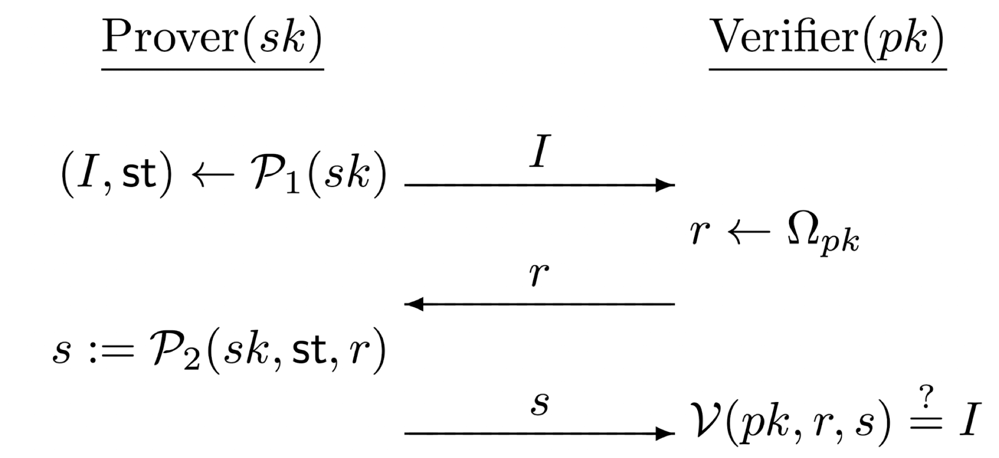
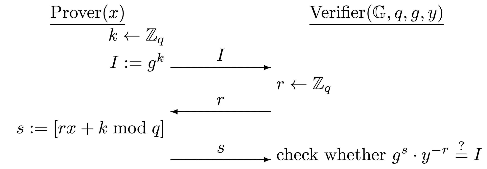

# PQC: Digital Signature - Identification Scheme

**Hemingway Bridge:**

- [ ]  Provide Proof for Theorem 12.10
- [ ]  Add the observation on the Schnorr identification scheme
- [ ]  Provide Proof for Theorem 12.11

---

# Theory:

**Chapter 12: Digital Signature**

12.5. Signatures from the Discrete-Logarithm Problem:

## Identification Schemes:

---

Identification Scheme:

- Interactive protocol
- Allow one party to prove its identity to another

Description:

- Two parties
    - **Prover** - **Verifier**
- The verifier only knows the public key of the prover
- **Identification sucess means the verifier is communicating with the intended prover**
- The protocol
    - Private key $sk$ - Public key $pk$
    - Three algorithms: $P_1$, $P_2$, $V$
    - Initial message $I$ and some state $st$
    - Challenge $r$ chosen from some set $\Omega_{pk}$
    - Response $s$
    
    
    

The scheme is **non-degenerate**

- There are many possible initial message $I$, and none has a high probability of being sent
    
    $$
    \forall sk \, \land \, \forall I \quad|\quad \textnormal{Pr}[P_1(sk) = I] = \textnormal{negl}(n) 
    $$
    

Security requirement

- An adversary who does not know the prover’s $sk$ should not be able to fool the verifier into accepting

### Security Model:

Let $\Pi = (\textnormal{Gen},P_1, P_2, V)$ be an identification scheme

Consider an adversary $A$ and parameter $n$

The identification experiment $\textnormal{Ident}_{A,\Pi}(n)$

1. $\textnormal{Gen}(1^n)$ is run to obtain keys $(sk, pk)$
2. $A$  is given $pk$ and access to an oracle $\textnormal{Trans}_{sk}$ that it can query as often as it likes
3. At any point during the experiment, $A$ outputs a message $I$
A uniform challenge $r \in \Omega_{pk}$ is chosen and given to $A$, who responds with some $s$
4. The experiment output $1$ iff $V(pk, r, s) \overset{?}{=} I$

### Definition 12.8:

An identification scheme $\Pi = (\textnormal{Gen},P_1, P_2, V)$ is secure against a passive attack, or just secure, if $\forall$ PPT $A$, $\exist$ a negligible function $\textnormal{negl}$ such that

$$
\textnormal{Pr}[\textnormal{Ident}_{A,\Pi}(n) = 1] \leq \textnormal{negl}(n)
$$

## Fiat-Shamir Transformation:

---

### Construction 12.9:

Let $(\textnormal{Gen}_{id}, P_1, P_2, V)$ be an identification scheme

Construct the signature as follows:

- $\textnormal{Gen}$:
    - Input $1^n$, run $\textnormal{Gen}_{id}(1^n)$ to obtain $pk, sk$
    - $pk$ specifies a set of challenges $\Omega_{pk}$
    - An implicit function $H: \{0, 1\}^* \rightarrow \Omega_{pk}$ is specified
- $\textnormal{Sign}$:
    - Input $sk$ and a message $m \in \{0,1\}^*$
    - Do
        1. Compute $(I,\textnormal{st}) \leftarrow P_1(sk)$
        2. Compute $r := H(I,m)$
        3. Compute $s:= P_2(sk,\textnormal{st},r)$
    - Output the signature $(r, s)$
- $\textnormal{Vrfy}$:
    - Input $pk$, message $m$, and a signature $(r,s)$
    - Compute $I:=V(pk,r,s)$
    - Output 1 iff $H(I,m) \overset{?}{=} r$

### Theorem 12.10:

Let $\Pi$ be an identification scheme, let $\Pi'$ be the signature scheme that results by applying the Fiat-Shamir transform to it.

If $\Pi$ is secure and $H$ is modeled as a random oracle, then $\Pi'$ is secure.

- **PROOF:**

## Schnorr Signature:

---

### The Schnorr Identification Scheme:

The Schnorr identification scheme is based on hardness of the discrete-logarithm problem

**Security Model:**

- Let $G$ be a polynomial-time algorithm taking $1^n$ as input and outputing a description of a cyclic group $\mathbb{G}$, its order $q$ (with $||q|| = n$), and a generator $g$
- Key generation:
    - The prover runs $G(1^n)$ to obtain $(\mathbb{G},q,g)$
    - Choose a uniform $x \in \mathbb{Z}_q^*$ and set $y:=g^x$
    - Public key: $(\mathbb{G},q,g,y)$
    - Private key: $x$
- Execution:
    - Prover:
        - Choose a uniform $k \in \mathbb{Z}_q^*$ and set $I:=g^k$
        - Send I as the initial message
    - Verifier:
        - Choose and send a uniform challenge $r \in \mathbb{Z}_q$
    - Prover:
        - Compute $s:=[rx+k\;\textnormal{mod}\,q]$
    - Verifier:
        - Accept iff $g^s.y^{-r}\overset{?}{=}I$
    
    
    

$I$  is uniform in $\mathbb{G}$ → **The scheme is non-degenerate**

**Correctness:**

$$
g^s.y^{-r}=g^{rx+k}.(g^x)^{-r} = g^k=I
$$

**Observation:**

### **Theorem 12.11:**

If the discrete-logarithm problem is hard relative to $G$, then the Schnorr identification scheme is secure.

- **PROOF:**

### Schnorr Signature Construction:

Let $G$ be as described above

- $\textnormal{Gen}$:
    - Run $G(1^n)$ to obtain $(\mathbb{G},q,g)$
    - Choose a uniform $x \in \mathbb{Z}_q$ and set $y:=g^x$
    - Private key: $x$
    - Public key: $(\mathbb{G},q,g,y)$
    - $H:\{0,1\}^* \rightarrow \mathbb{Z}_q$ is implicitly specified
- $\textnormal{Sign}$:
    - Input a private key $x$ and a message $m \in \{0,1\}^*$
    - Choose a uniform $k \in \mathbb{Z}_q$ and set $I:=g^k$
    - Compute $r:=H(I,m)$
    - Compute $s:=[rx + k\,\textnormal{mod}\,q]$
    - Output signature $(r,s)$
- $\textnormal{Vrfy}$:
    - Input a public key $(\mathbb{G},q,g,y)$, a message $m$, a signature $(r,s)$
    - Compute $I:=g^s.y^{-r}$
    - Output $1$ iff $H(I,m)\overset{?}{=} r$